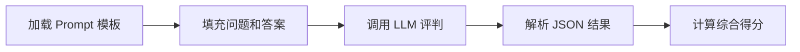

# 评测系统使用指南 (Evaluation System Guide)

## 📋 目录

- [概述](#概述)
- [评分机制](#评分机制)
- [使用方法](#使用方法)
- [评测题目](#评测题目)
- [评分器详解](#评分器详解)
- [评测报告](#评测报告)
- [常见问题](#常见问题)

---

## 概述

SuperalloyKgRAG 评测系统是一个多级别、多维度的自动化评测框架，用于评估知识图谱增强的检索问答系统在超合金领域的性能。

### 核心特性

- ✅ **多级难度评测**: 支持 L1/L2/L3/L4 四个难度级别
- ✅ **分层评分机制**: 针对不同难度采用不同的评分策略
- ✅ **异步批量处理**: 支持高并发评测
- ✅ **详细评测报告**: 生成多维度统计分析
- ✅ **灵活配置**: 支持自定义评测集和评分参数

### 系统架构

```
evaluation/
├── auto_evaluator.py      # 主评测器（已合并 run_evaluation）
├── scoring.py             # 分级评分器
└── baseline.py            # 基线模型对比

data/
├── evaluation_sets/       # 评测题目集
│   ├── L12.json          # L1/L2 级别题目
│   ├── L3.json           # L3 级别题目
│   └── L4.json           # L4 级别题目
├── answers/              # 评测答案（JSONL 格式）
└── reports/              # 评测报告（JSON 格式）
```

---

## 评分机制

评测系统根据问题难度采用不同的评分策略，确保评估的准确性和公平性。

### 难度分级

| 难度级别 | 问题类型 | 示例 | 评分方法 |
|---------|---------|------|---------|
| **L1** | 事实检索 | "Inconel 718 的主要合金元素有哪些？" | 关键词匹配 + 语义相似度 |
| **L2** | 简单推理 | "γ' 相的体积分数对蠕变性能有何影响？" | 关键词匹配 + 语义相似度 |
| **L3** | 综合分析 | "对比定向凝固和单晶技术的优缺点。" | LLM-as-Judge + 要点覆盖率 |
| **L4** | 设计/发现 | "设计一种抗高温氧化的涡轮叶片合金。" | LLM-as-Judge + 推理链完整性 |

---

### L1/L2 评分机制

**适用场景**: 事实检索和简单推理问题

#### 评分组成

```
Overall Score = 0.6 × Keyword_F1 + 0.4 × Semantic_Similarity
```

#### 1. 关键词匹配 (60% 权重)

提取并匹配三类关键信息：

##### (1) 数值信息 (40% 权重)
- **匹配内容**: 数字、百分比、温度、压力、成分等
- **正则模式**: `[\d]+(?:\.[\d]+)? (?:MPa|GPa|℃|wt.%|at.%)`
- **示例**:
  - `"650℃"` → 匹配
  - `"45-55 wt.%"` → 匹配
  - `"约 1200 MPa"` → 匹配

##### (2) 合金名称/化学式 (20% 权重)
- **匹配内容**: 合金牌号、元素符号、化学式
- **正则模式**: `Ni|Co|Fe|Cr|Mo|W|Re|...|CMSX-4|IN718|...`
- **示例**:
  - `"Inconel 718"` → 匹配
  - `"Ni-Cr-Mo"` → 匹配
  - `"CMSX-4"` → 匹配

##### (3) 专业术语 (40% 权重)
- **匹配内容**: 相结构、强化机制、工艺方法等
- **术语库**: 包含 100+ 超合金领域术语
- **示例**:
  - `"γ' 相"`、`"固溶强化"`、`"定向凝固"`
  - `"蠕变"`、`"筏化"`、`"TCP 相"`

#### 2. 语义相似度 (40% 权重)

- **方法**: 使用 Embedding 模型计算余弦相似度
- **模型**: `text-embedding-v4` (768 维)
- **计算公式**:
  ```
  Semantic_Score = cosine_similarity(embedding(answer), embedding(ground_truth))
  ```

#### 评分示例

**问题**: "Inconel 718 的时效处理温度是多少？"

**标准答案**: "Inconel 718 通常在 720℃ 进行时效处理，保温 8 小时。"

**模型答案**: "IN718 合金的时效温度为 720℃，时效时间约 8h。"

**评分计算**:
```
1. 关键词匹配:
   - 数值: [720℃, 8] → F1 = 1.0
   - 合金: [Inconel 718, IN718] → F1 = 1.0
   - 术语: [时效] → F1 = 1.0
   → Keyword_F1 = 0.4×1.0 + 0.2×1.0 + 0.4×1.0 = 1.0

2. 语义相似度:
   → Semantic_Score = 0.95

3. 综合得分:
   → Overall_Score = 0.6×1.0 + 0.4×0.95 = 0.98
```

---

### L3 评分机制

**适用场景**: 综合性问题，需要多维度分析

#### 评分组成

```
Overall Score = 0.8 × LLM_Judge_Score + 0.2 × Semantic_Score
```

#### LLM-as-Judge 评估维度

使用 LLM 作为评判器，评估回答的多个维度：

| 维度 | 权重 | 评估内容 | 分数范围 |
|-----|------|---------|---------|
| **要点覆盖率** (Coverage) | 40% | 是否覆盖所有关键要点 | 0-1 |
| **准确性** (Accuracy) | 35% | 信息是否正确 | 0-1 |
| **逻辑性** (Coherence) | 25% | 回答是否连贯、结构化 | 0-1 |

#### 评判流程



#### Prompt 模板

评判使用的 Prompt 模板位于 `config/prompts/evaluation_l3.md`，包含：

1. **角色定义**: 定义 LLM 作为超合金领域专家评判员
2. **评分标准**: 详细说明各维度的评分细则
3. **输出格式**: JSON 格式，包含各维度得分和反馈

#### 评分示例

**问题**: "对比定向凝固和单晶技术的优缺点。"

**LLM 评判结果**:
```json
{
  "coverage_score": 0.9,
  "accuracy_score": 0.85,
  "coherence_score": 0.8,
  "overall_score": 0.86,
  "key_points": [
    "晶界消除",
    "蠕变性能提升",
    "成本差异",
    "制造难度"
  ],
  "feedback": "回答覆盖了主要技术特点，但对成本分析不够深入。"
}
```

**最终得分**:
```
Overall_Score = 0.8 × 0.86 + 0.2 × 0.82 = 0.852
```

---

### L4 评分机制

**适用场景**: 设计/发现任务，需要完整推理链

#### 评分组成

```
Overall Score = 0.3 × Conflict_Score + 0.35 × Mechanism_Score + 0.35 × Solution_Score
```

#### 推理链评估维度

| 维度 | 权重 | 评估内容 |
|-----|------|---------|
| **冲突识别** (Conflict Identification) | 30% | 是否准确识别性能冲突或设计约束 |
| **机理调用** (Mechanism Invocation) | 35% | 是否正确引用科学机理和原理 |
| **方案给出** (Solution Proposal) | 35% | 是否提出合理可行的解决方案 |

#### 评估标准

每个维度的评分标准：

##### 1. 冲突识别 (0-1 分)
- **1.0**: 准确识别所有关键冲突，分析透彻
- **0.7**: 识别主要冲突，但分析不够深入
- **0.4**: 部分识别冲突，遗漏重要方面
- **0.0**: 未识别冲突或完全错误

##### 2. 机理调用 (0-1 分)
- **1.0**: 正确引用多个相关机理，解释清晰
- **0.7**: 引用主要机理，解释基本正确
- **0.4**: 机理引用不准确或不充分
- **0.0**: 未引用机理或完全错误

##### 3. 方案给出 (0-1 分)
- **1.0**: 提出创新且可行的完整方案
- **0.7**: 方案合理但不够详细或创新
- **0.4**: 方案不完整或可行性存疑
- **0.0**: 未提出方案或方案不合理

#### 评分示例

**问题**: "设计一种同时具有高温强度和抗氧化性的镍基单晶高温合金。"

**LLM 评判结果**:
```json
{
  "conflict_identification": {
    "score": 0.9,
    "comments": "准确识别了强度-氧化性冲突，指出 Al/Cr 含量平衡问题。"
  },
  "mechanism_invocation": {
    "score": 0.85,
    "comments": "引用了 γ' 相强化、氧化膜保护等关键机理。"
  },
  "solution_proposal": {
    "score": 0.8,
    "comments": "提出了具体的成分设计和工艺路线，但热处理参数不够详细。"
  },
  "overall_score": 0.85,
  "reasoning_chain_complete": true,
  "feedback": "推理链完整，但可进一步优化热处理方案。"
}
```

**最终得分**:
```
Overall_Score = 0.3 × 0.9 + 0.35 × 0.85 + 0.35 × 0.8 = 0.8475
```

---

## 使用方法

### 基本用法

#### 1. 命令行运行

```bash
# 评测所有题目
python evaluation/auto_evaluator.py

# 评测指定难度级别
python evaluation/auto_evaluator.py --difficulty L3

# 评测指定题目 ID
python evaluation/auto_evaluator.py --ids 1,2,3

# 设置并发数
python evaluation/auto_evaluator.py --concurrency 10

# 使用自定义配置文件
python evaluation/auto_evaluator.py --settings custom_settings.yaml
```

#### 2. 程序化调用

```python
import asyncio
from evaluation.auto_evaluator import AutoEvaluator

# 方式 1: 从配置文件创建
evaluator = AutoEvaluator.from_config(
    settings_filename="settings.yaml",
    max_concurrency=5
)

# 运行评测
report = asyncio.run(evaluator.run(
    difficulty="L3",
    question_ids=[1, 2, 3],
    save_intermediate=True
))

print(report)
```

```python
# 方式 2: 手动配置
import yaml

with open("config/settings.yaml") as f:
    config = yaml.safe_load(f)

evaluator = AutoEvaluator(config, max_concurrency=10)
report = asyncio.run(evaluator.run(difficulty="L4"))
```

### 高级用法

#### 自定义评测集

在 `data/evaluation_sets/` 下创建自定义 JSON 文件：

```json
[
  {
    "id": 1,
    "question": "你的问题",
    "ground_truth": "标准答案",
    "difficulty": "L3",
    "type": "综合分析",
    "domain": "强化机制",
    "theme": "γ' 相强化"
  }
]
```

#### 批量评测

```python
# 加载自定义题目
from evaluation.auto_evaluator import EvaluationDataLoader

loader = EvaluationDataLoader()
questions = loader.load_questions(difficulty="L2")

# 执行评测
evaluator = AutoEvaluator.from_config()
results = await evaluator.evaluate_batch(questions)

# 生成报告
report = evaluator.generate_report(results, report_name="custom_report")
```

#### 单题评测

```python
# 评测单道题目
result = await evaluator.evaluate_single({
    "id": 1,
    "question": "Inconel 718 的主要合金元素是什么？",
    "ground_truth": "Ni, Cr, Fe, Nb, Mo, Ti, Al",
    "difficulty": "L1",
    "type": "事实检索",
    "domain": "成分设计"
})

print(f"得分: {result['overall_score']:.3f}")
```

---

## 评测题目

### 题目结构

每道题目包含以下字段：

```json
{
  "id": 1,                          // 题目唯一标识
  "question": "问题文本",            // 问题内容
  "ground_truth": "标准答案",        // 参考答案
  "difficulty": "L1",               // 难度级别
  "type": "事实检索",                // 问题类型
  "domain": "成分设计",              // 所属领域
  "theme": "合金元素",               // 主题标签
  "source_file": "L12.json"         // 来源文件
}
```

### 题目分布

| 难度 | 题目数量 | 文件 | 问题类型 |
|-----|---------|------|---------|
| L1/L2 | ~50 | L12.json | 事实检索、简单推理 |
| L3 | ~30 | L3.json | 综合分析、对比论述 |
| L4 | ~20 | L4.json | 设计任务、发现问题 |

### 领域分类

- 成分设计
- 相结构与演化
- 强化机制
- 制造工艺
- 性能表征
- 失效机制
- 组织性能关系

---

## 评分器详解

### 评分器继承结构

```
BaseScorer (抽象基类)
├── L1L2Scorer (关键词 + 语义)
├── L3Scorer (LLM-Judge + 要点)
└── L4Scorer (推理链完整性)
```

### 关键组件

#### 1. KeywordMatcher (关键词匹配器)

```python
from evaluation.scoring import KeywordMatcher

matcher = KeywordMatcher()

# 提取关键词
keywords = matcher.extract_keywords(text)
# 返回: {"numbers": [...], "alloys": [...], "terms": [...]}

# 计算匹配得分
scores = matcher.calculate_match_score(answer_keywords, truth_keywords)
# 返回: {"numbers_f1": 0.9, "alloys_f1": 0.8, ...}
```

#### 2. SemanticScorer (语义评分器)

```python
from evaluation.scoring import SemanticScorer

scorer = SemanticScorer(config)

# 计算语义相似度
similarity = scorer.score(answer, ground_truth)
# 返回: 0.0 - 1.0
```

#### 3. LLMJudge (LLM 评判器)

```python
from evaluation.scoring import LLMJudge

judge = LLMJudge(config)

# 进行 L3 评判
result = judge.judge(question, answer, ground_truth, level="l3")
# 返回: {"coverage_score": 0.9, "accuracy_score": 0.85, ...}
```

#### 4. ScorerFactory (评分器工厂)

```python
from evaluation.scoring import ScorerFactory

factory = ScorerFactory(config)

# 根据难度获取评分器
scorer = factory.get_scorer("L3")

# 直接评分
result = factory.score(
    question=question,
    answer=answer,
    ground_truth=ground_truth,
    difficulty="L3"
)
```

---

## 评测报告

### 报告结构

评测完成后，系统生成两类文件：

#### 1. 详细答案 (JSONL 格式)

位置: `data/answers/evaluation_YYYYMMDD_HHMMSS.jsonl`

每行一个 JSON 对象，包含完整的评测信息：

```json
{
  "id": 1,
  "question": "问题文本",
  "theme": "主题",
  "difficulty": "L3",
  "type": "综合分析",
  "domain": "强化机制",
  "ground_truth": "标准答案",
  "answer": "模型回答",
  "scores": {
    "overall_score": 0.85,
    "coverage_score": 0.9,
    "accuracy_score": 0.85,
    "coherence_score": 0.8,
    "feedback": "评价反馈"
  },
  "overall_score": 0.85,
  "answer_time_seconds": 3.5,
  "score_time_seconds": 1.2,
  "timestamp": "2025-12-23T10:30:00"
}
```

#### 2. 统计报告 (JSON 格式)

位置: `data/reports/evaluation_report_YYYYMMDD_HHMMSS.json`

包含多维度统计分析：

```json
{
  "report_name": "evaluation_report_20251223_103000",
  "generated_at": "2025-12-23T10:35:00",
  "overall_statistics": {
    "total_questions": 100,
    "successful_evaluations": 98,
    "failed_evaluations": 2,
    "avg_score": 0.82,
    "min_score": 0.45,
    "max_score": 0.98
  },
  "by_difficulty": {
    "L1": {"count": 20, "avg_score": 0.88, "min_score": 0.65, "max_score": 0.98},
    "L2": {"count": 30, "avg_score": 0.85, "min_score": 0.60, "max_score": 0.95},
    "L3": {"count": 30, "avg_score": 0.79, "min_score": 0.55, "max_score": 0.92},
    "L4": {"count": 20, "avg_score": 0.75, "min_score": 0.45, "max_score": 0.90}
  },
  "by_domain": {
    "成分设计": {"count": 25, "avg_score": 0.85},
    "强化机制": {"count": 30, "avg_score": 0.80},
    "制造工艺": {"count": 20, "avg_score": 0.82},
    "性能表征": {"count": 25, "avg_score": 0.81}
  },
  "by_type": {
    "事实检索": {"count": 30, "avg_score": 0.87},
    "简单推理": {"count": 20, "avg_score": 0.84},
    "综合分析": {"count": 30, "avg_score": 0.79},
    "设计任务": {"count": 20, "avg_score": 0.75}
  }
}
```

### 报告分析

使用报告进行性能分析：

```python
import json

# 加载报告
with open("data/reports/evaluation_report_20251223.json") as f:
    report = json.load(f)

# 分析难度性能
for difficulty, stats in report["by_difficulty"].items():
    print(f"{difficulty}: {stats['avg_score']:.3f}")

# 找出低分题目
with open("data/answers/evaluation_20251223.jsonl") as f:
    for line in f:
        result = json.loads(line)
        if result["overall_score"] < 0.6:
            print(f"Low score: {result['id']} - {result['question'][:50]}")
```

---

## 常见问题

### Q1: 如何添加新的评测题目？

**A**: 在 `data/evaluation_sets/` 下编辑对应难度的 JSON 文件，按照标准格式添加题目。

### Q2: 评分结果不合理怎么办？

**A**: 
1. 检查 `ground_truth` 是否准确
2. 对于 L3/L4，调整 Prompt 模板 (`config/prompts/evaluation_l3.md`)
3. 修改评分权重 (在 `scoring.py` 中)

### Q3: 如何自定义评分策略？

**A**: 继承 `BaseScorer` 类并实现 `score` 方法：

```python
from evaluation.scoring import BaseScorer

class CustomScorer(BaseScorer):
    def score(self, question, answer, ground_truth, **kwargs):
        # 自定义评分逻辑
        return {"overall_score": 0.85, "custom_metric": 0.9}
```

### Q4: 评测速度太慢怎么办？

**A**: 
1. 增加并发数: `--concurrency 10`
2. 使用更快的模型 (修改 `settings.yaml`)
3. 只评测部分题目: `--ids 1,2,3`

### Q5: LLM 评判不稳定怎么办？

**A**: 
1. 降低 `temperature` (默认 0.1)
2. 优化 Prompt 模板，提供更明确的评分标准
3. 多次评判取平均值

### Q6: 如何对比不同模型的性能？

**A**: 使用 `baseline.py` 模块：

```python
from evaluation.baseline import BaselineComparator

comparator = BaselineComparator()
comparison = await comparator.compare(
    models=["qwen3-max", "gpt-4"],
    difficulty="L3"
)
```

### Q7: 如何查看评测日志？

**A**: 日志保存在 `logs/evaluation.log`，包含详细的评测过程信息。

---

## 配置参数

评测系统使用 `config/settings.yaml` 中的以下参数：

```yaml
# 查询模型配置
query:
  generation_model: qwen3-max
  temperature: 0.7

# Embedding 配置
embedding:
  model: text-embedding-v4
  dimensionality: 768

# 评测配置
evaluation:
  max_concurrency: 5
  save_intermediate: true
  timeout_seconds: 60
```

---

## 最佳实践

1. **渐进式评测**: 先评测少量题目验证系统，再进行大规模评测
2. **定期更新题库**: 根据系统弱点补充针对性题目
3. **保留历史报告**: 便于跟踪性能改进
4. **分析低分题目**: 重点优化表现不佳的领域
5. **对比基线模型**: 验证知识图谱的增益效果

---

## 技术支持

如有问题，请参考：
- [架构文档](ARCHITECTURE.md)
- [索引指南](RUN_INDEXING_GUIDE.md)
- [推理指南](REASONING_GUIDE.md)

或提交 Issue 到项目仓库。

---

**最后更新**: 2025-12-23
**版本**: 2.0

